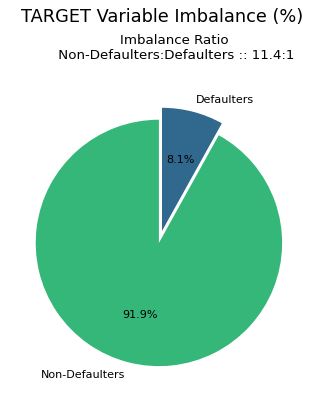
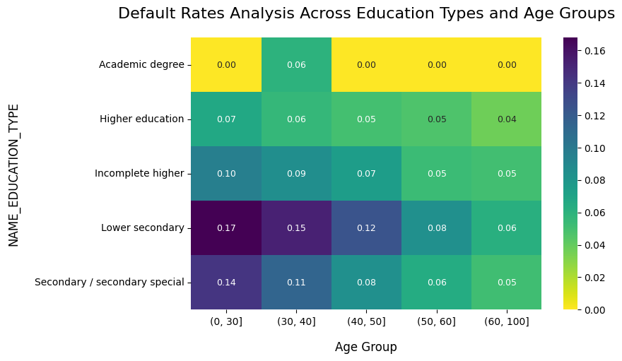
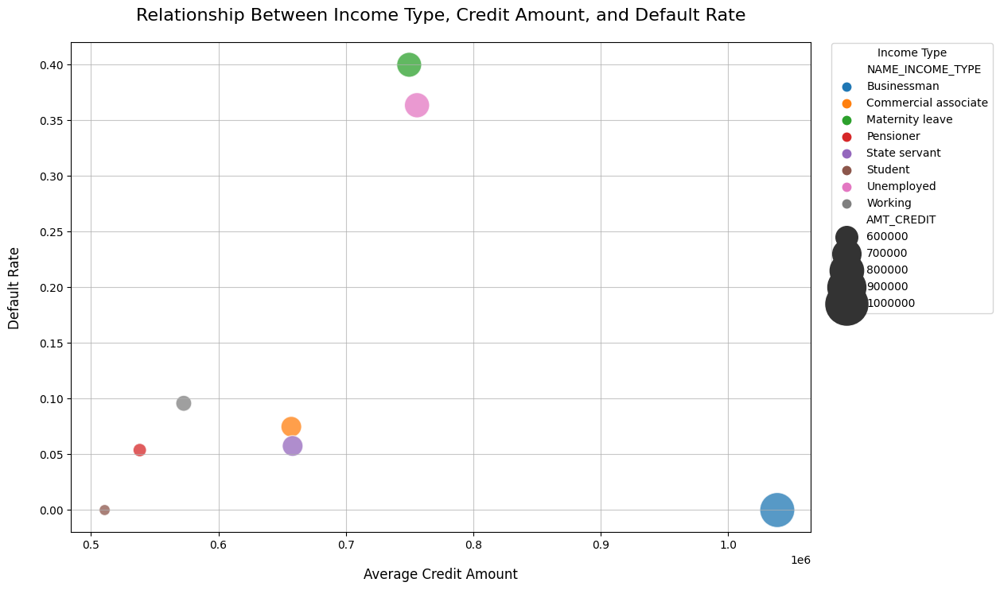
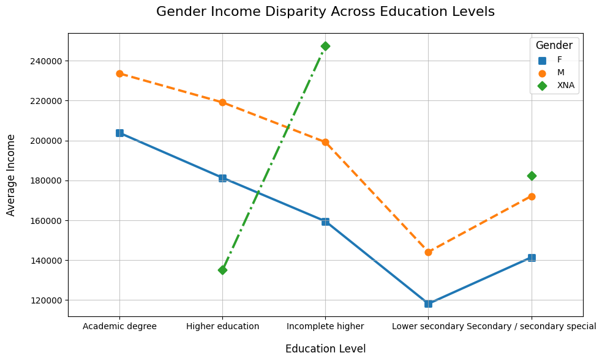
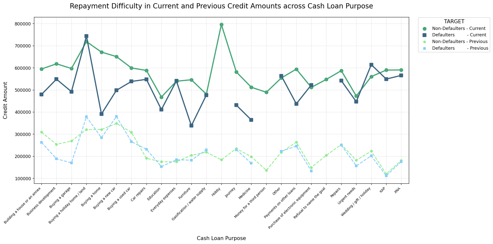

# Loan Default Risk Analysis

This repository contains a comprehensive exploratory data analysis (EDA) project focused on identifying the key drivers of loan default risk. The analysis is performed on a large-scale financial dataset, aiming to uncover patterns and insights that can inform better risk assessment and lending decisions.

The complete analysis, methodology, and findings are detailed in the associated Kaggle notebook.

**My Kaggle Notebook:** [Loan Default Risk - Exploratory Data Analysis](https://www.kaggle.com/code/sachinkanchan92/loan-default-risk-exploratory-data-analysis)

**Dataset:** [Loan Defaulter](https://www.kaggle.com/datasets/gauravduttakiit/loan-defaulter)

---

## 1. Project Overview

### 1.1. Business Problem

Lending companies face the challenge of assessing loan applications from individuals with limited or non-existent credit histories. Approving a loan to a client who is likely to default leads to financial loss, while denying a loan to a creditworthy client results in lost business. This project uses EDA to understand how consumer attributes and loan characteristics influence the tendency to default, enabling the company to make more informed lending decisions.

### 1.2. Objectives

*   Identify the key variables that are strong indicators of loan default.
*   Analyze patterns in demographic, financial, and behavioral data to understand default risk.
*   Provide strategic recommendations to help the company minimize risk and optimize its lending portfolio.
*   Handle and analyze a large, complex dataset with over 1.6 million historical records and 300,000 current applications.

---

## 2. Methodology

The analysis follows a structured data science workflow, from data preparation to insight generation:

1.  **Data Cleaning & Preparation:**
    *   Handled high percentages of missing values by dropping columns with over 35% nulls.
    *   Standardized `DAYS_*` columns by converting negative day counts into positive `YEARS_*` features for better interpretability.
    *   Corrected data types to optimize memory usage by over 80%, converting object columns to 'category' and numerical flags to boolean.

2.  **Outlier Detection & Treatment:**
    *   Identified outliers in key numerical columns (e.g., `AMT_INCOME_TOTAL`, `YEARS_EMPLOYED`) using the Interquartile Range (IQR) method.
    *   Capped outliers at the upper and lower bounds to preserve data integrity while mitigating the impact of extreme values.

3.  **Feature Engineering & Merging:**
    *   Aggregated over 1.6 million historical loan records at the client level, creating new features that summarize a client’s past borrowing behavior (e.g., average previous credit amount, most frequent contract status).
    *   Merged the aggregated historical data with the current application data to create a comprehensive analytical dataset.

4.  **Exploratory Data Analysis (EDA):**
    *   **Univariate Analysis:** Analyzed the distribution of individual features and their relationship with the `TARGET` variable (default status).
    *   **Bivariate & Multivariate Analysis:** Used heatmaps, point plots, and scatter plots to investigate the complex interactions between multiple variables, such as education, age, income, and loan purpose.

---

## 3. Key Findings & Visualizations

### Target Variable Imbalance

The dataset is highly imbalanced, with only 8.1% of clients having payment difficulties. This is a critical consideration for any future predictive modeling.

### The Role of Education and Age

Default rates are strongly correlated with both education level and age. Younger applicants with lower education levels represent the highest-risk segment.

### Income Type vs. Credit Amount and Default Rate

The relationship between credit amount and default risk is non-linear and varies significantly by income type. Businessmen, despite having the highest average credit amounts, have a near-zero default rate, while unemployed applicants have a very high default rate with lower credit amounts.

### Gender and Income Disparities

Across all education levels, a consistent gender pay gap is visible, which can influence borrowing capacity and financial stability.

### Repayment Difficulty by Loan Purpose

Analysis shows that non-defaulters are often approved for higher credit amounts than defaulters. However, certain loan purposes, like "Buying a holiday home/land" and "Business development," are associated with higher credit amounts and require careful risk assessment.

---

## 4. Summary of Key Driving Factors

The analysis identified that default risk is driven by a complex interplay of factors rather than a single variable. The most powerful predictors include:

*   **Applicant Stability:**
    *   **Education & Occupation:** Lower education levels (e.g., *Lower secondary*) and certain occupations (*Low-skill Laborers*) are strongly correlated with higher default rates.
    *   **Employment Duration:** Longer employment history signals financial stability and corresponds to lower default risk.
*   **Financial & Behavioral History:**
    *   **External Data Sources:** `EXT_SOURCE` scores are among the strongest individual predictors of default.
    *   **Previous Application History:** The status of a client’s past loans (e.g., 'Refused') is a critical indicator of future risk.
    *   **Application Timing:** Subtle behavioral flags, such as applying for a loan in the early morning hours (4 AM - 7 AM), consistently correlate with higher default rates.

## 5. Strategic Recommendations

Based on these findings, the following strategies are recommended for risk mitigation:

1.  **Develop a Granular, Multi-Factor Risk Model:** Incorporate the identified key drivers—especially `EXT_SOURCE` scores, education, occupation, and client history—to build a more accurate and nuanced risk assessment model.
2.  **Implement Dynamic and Segmented Lending Policies:** Tailor credit offers and terms based on applicant risk profiles. High-risk segments should receive more conservative terms, while stable, low-risk profiles can be offered higher credit lines.
3.  **Refine the Application & Verification Process:** Implement automated flags for applications submitted during high-risk hours to trigger additional review and ensure that a client's aggregated historical data is a core part of the decision-making process.